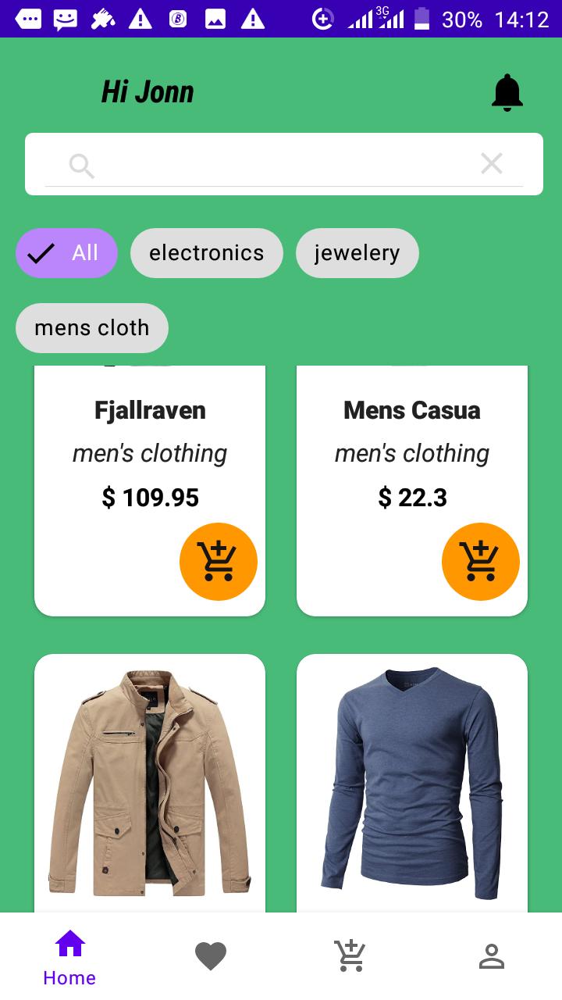
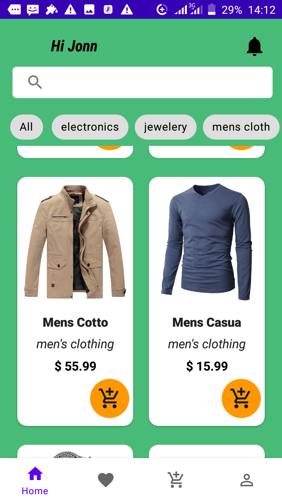
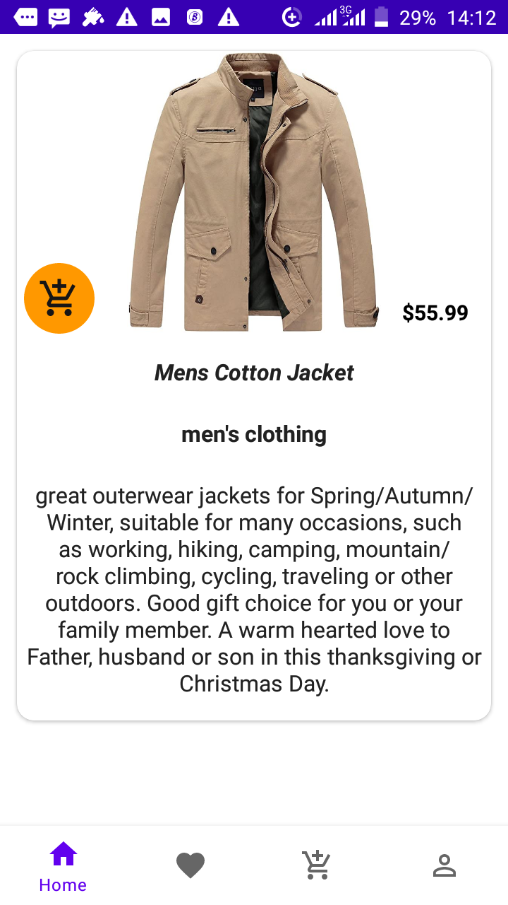
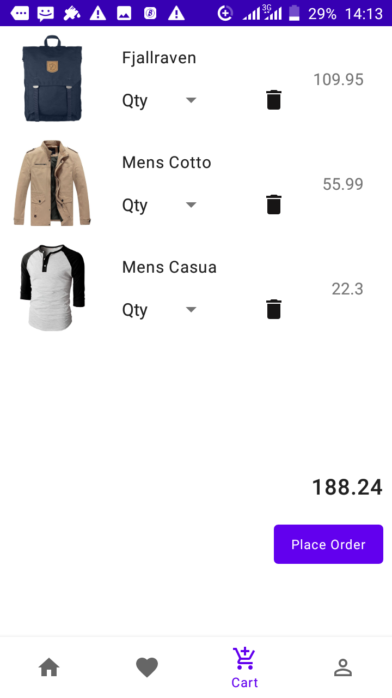

##consuming fakestoraeApi  https://fakestoreapi.com/

This API does not provide an endpoint for registering, 
just login with the credentials provided in the README file",
	##login Details
	####Username: mor_2314
	####password: 83r5^_

## Screenshoots
These are the app's screenshots:

 
 

## Demo

 
